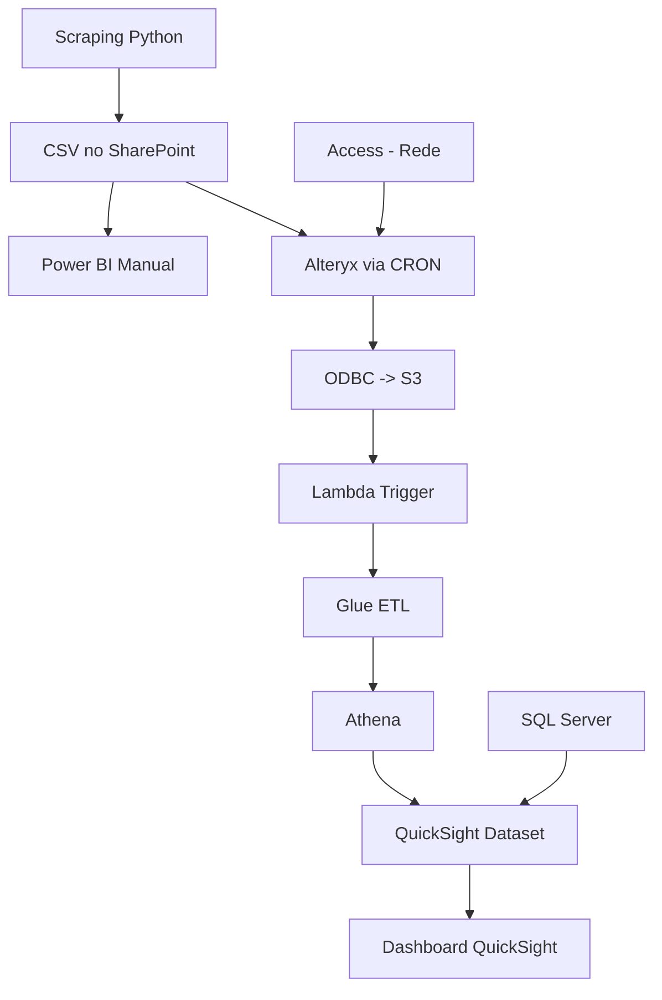
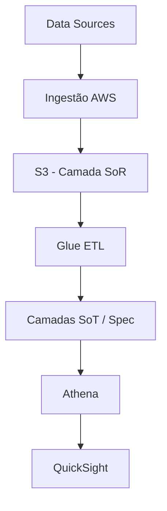

# Contexto da Modernização

A modernização do ecossistema de dados tem como objetivo substituir uma arquitetura heterogênea, fortemente dependente de ferramentas locais, scripts manuais e integrações frágeis, por uma arquitetura padronizada, escalável e governada na AWS. O direcionador principal não é apenas tecnológico, mas estrutural: centralizar a responsabilidade de ingestão e disponibilização de dados na camada de tecnologia, enquanto a camada analítica passa a consumir dados já tratados e confiáveis.

Nesse cenário, a AWS atua como plataforma unificadora, utilizando serviços como S3 (armazenamento), Glue (ETL e catálogo), Athena (consulta), Step Functions/EventBridge (orquestração) e QuickSight (consumo). No entanto, a solução deve ser agnóstica de ferramenta na camada de governança, permitindo evoluções tecnológicas sem comprometer o modelo de controle.

A modernização exige compreender o estado atual (“AS-IS”) com granularidade suficiente para permitir decisões estruturadas de priorização, risco e esforço, e definir um estado futuro (“TO-BE”) com base em padrões arquiteturais claros.

---

# Modelo Conceitual de Pipeline de Dados

Independentemente da tecnologia, qualquer pipeline pode ser abstraída em quatro etapas fundamentais:
* Extração: conexão com fontes de dados (bancos, APIs, arquivos, sistemas externos)
* Transformação: aplicação de regras de negócio, limpeza, enriquecimento e padronização
* Carga: persistência dos dados tratados em um repositório estruturado
* Consumo: disponibilização para usuários finais ou sistemas downstream

Essa abstração é importante porque permite dissociar o problema da ferramenta utilizada e focar na função exercida dentro da arquitetura.

---

# Análise da Pipeline Atual (AS-IS)

O exemplo apresentado evidencia um cenário típico de fragmentação tecnológica e acoplamento operacional:

Esse fluxo apresenta alguns problemas estruturais relevantes:

A ingestão depende de scraping, que é inerentemente frágil, sujeito a mudanças de interface e sem garantias de integridade. O armazenamento intermediário em CSV no SharePoint cria dependência de arquivos não governados, sem versionamento adequado. A orquestração é distribuída (manual, cron, eventos), dificultando rastreabilidade. Há múltiplas ferramentas de ETL (Python, Alteryx, Glue), o que fragmenta a lógica de transformação. A ativação do ETL via Lambda acoplada ao S3 indica ausência de uma orquestração centralizada. O consumo ainda depende de junções em tempo de visualização (QuickSight com SQL Server), aumentando latência e complexidade.

Em termos de arquitetura, isso representa baixa coesão e alto acoplamento, além de um fluxo difícil de observar e governar.

---

# Arquitetura Alvo (TO-BE)

A arquitetura alvo busca centralizar responsabilidades, reduzir redundâncias e padronizar o fluxo dentro da AWS.

A principal mudança conceitual é a separação clara de responsabilidades:

A ingestão passa a ser responsabilidade da tecnologia, eliminando scraping e dependência de arquivos intermediários. O S3 se torna o ponto central de armazenamento, estruturado em camadas (SoR, SoT, Spec), permitindo governança e versionamento. O Glue assume o papel de engine de transformação, consolidando regras de negócio. O Athena fornece acesso padronizado aos dados, desacoplando armazenamento e consumo. A orquestração é centralizada via Step Functions/EventBridge, eliminando execuções manuais e distribuídas.

Essa abordagem reduz significativamente a complexidade operacional e aumenta a rastreabilidade.

---

# Princípios de Modernização

A modernização tecnológica transcende a mera substituição de ferramentas; ela exige uma reestruturação fundamentada em princípios que garantam escalabilidade e eficiência. Abaixo, detalhamos os pilares que sustentam essa visão:

### 1. Princípios de Modernização
Para evitar a complexidade desnecessária e o débito técnico, a modernização deve seguir estas diretrizes:

* **Centralização de Dados:** Concentrar a ingestão e o armazenamento para eliminar a fragmentação de entradas.
* **Padronização de Pipelines:** Reduzir a diversidade tecnológica, priorizando fluxos de trabalho uniformes.
* **Desacoplamento de Camadas:** Separar rigidamente as etapas de ingestão, transformação e consumo.
* **Orquestração Transparente:** Substituir gatilhos (*triggers*) implícitos por uma orquestração explícita e observável.
* **Governança por Metadados:** Utilizar metadados para orientar a análise de dados e a priorização estratégica.

### 2. Sustentação
Refere-se ao conjunto de atividades essenciais para garantir a **continuidade operacional** dos ativos. Isso abrange desde o monitoramento e suporte técnico até manutenções corretivas, evolutivas e protocolos de recuperação de falhas (disaster recovery).

### 3. Entrega
É o resultado final consumido pelas áreas de negócio ou sistemas integrados. Enquanto a sustentação foca no "como" o dado flui, a entrega foca no **valor gerado**. Vale ressaltar que uma única entrega pode depender da composição de diversos ativos simultâneos.

> **Exemplo Prático:**
> Um **Dashboard Executivo** representa a **Entrega**. Já os pipelines, processos de ETL, views e automações que viabilizam esse painel são os **Ativos** que demandam **Sustentação** contínua.

---

# Modelo de Governança da Modernização

A governança da modernização deve ser tratada como um modelo de dados operacional, não apenas como um cadastro descritivo. O objetivo é permitir análises estruturadas, priorização baseada em critérios objetivos e rastreabilidade completa do ciclo de vida das pipelines.

Para isso, o modelo precisa atender três requisitos simultâneos: granularidade suficiente para análise, padronização para consistência e flexibilidade para acomodar diferentes tipos de pipelines.

A seguir, a seção é expandida com exemplos concretos em formato tabular, JSON e um modelo conceitual.

---

### Objetivo

A aplicação tem como objetivo atuar como **Governança**, responsável por **inventariar, padronizar, rastrear e controlar o ciclo de vida** dos ativos que suportam entregas da operação.

Nesse contexto, “ativo” não deve ser entendido apenas como um sistema ou um arquivo isolado, mas como qualquer elemento que participe da geração, transformação, publicação, disponibilização ou sustentação de uma entrega operacional. Isso inclui, por exemplo, pipelines de dados, ETLs, automações, dashboards, APIs, relatórios, exports, scripts, workflows e outros artefatos correlatos.

O propósito central da solução é permitir que a organização responda, de forma rápida e estruturada, perguntas como:

- **Identidade/Valor do ativo (o que é / O que deve ser feito)**
	- Que problema esse ativo resolve e onde ele se encaixa no negócio?*
	  
- **Ownership e stakeholders (quem responde)**
	- Quais são meus ativos de interesse?
	- Quem corrige quando quebra?
	- Quem assume quando se o responsável estiver ausente?
	- Quem decide mudança de regra?
	- Quem consome? Quem sofre impacto se parar?
	
- **Operação (como roda / Como é feito)**
	- Esse ativo está performando dentro do esperado?
	- Qual o custo operacional (tempo + infra)?
	- Existe gargalo?
	
- **Ciclo de vida (tempo)**
	- Esse ativo ainda deveria existir?
	- Está sendo usado ou virou legado morto?
	- Está na fila de modernização?
	- O ativo é monitorado?
	- Existem Alertas?
	  
- **Dependência e linhagem (como se conecta)**
	- Quais as fontes de dados?
	- Onde o resultado está sendo Disponibilizado?
	- Se eu mudar isso, quem quebra?
	- Se isso parar, o que para junto?
	- Existe redundância ou ponto único de falha?
	
- **Tecnologia e arquitetura (como é construído)**
	- Consigo reproduzir esse ativo?
	- Está aderente à arquitetura alvo?
	- Está dentro do padrão ou é exceção?
	
- **Governança e risco (controle)**
	- Se esse ativo falhar, qual o prejuízo?
	- Existe risco regulatório, Reputacional, Financeiro, Segurança ou Operacional?
	- Quem pode acessar?
	- Qual o nível de privilégio (Leitura, Modificação e etc)?
	- Qual o risco de um acesso indevido?
	
- **Documentação (capacidade de sustentação)**
	- Alguém novo conseguiria operar isso (Acessos, Setup e etc.)?
	- Alguém novo conseguiria entender os impactos e importância disso?
	- As regras estão explícitas ou escondidas no código?
 
- **Entregáveis e Evoluções (MoSCoW):**
	Must (Deve ter): Sobrevivência / MVP. Sem isso, o produto morre no lançamento.
	Should (Deveria ter): Eficiência. O produto vive sem, mas é difícil ou manual. É a primeira coisa a ser feita logo após o essencial.
	Could (Poderia ter): Encanto. São as melhorias que agregam valor, mas se o prazo apertar, ninguém chora.
	Won't (Não terá): Foco. Está fora do escopo atual para evitar desperdício de energia.
	
	**Exemplo: Uma Cafeteria**
	Imagine que você vai abrir uma cafeteria amanhã:
	Deve ter: Café e água. (Sem isso, não existe o negócio).
	Deveria ter: Xícaras de cerâmica. (Você pode servir em copo plástico se precisar, mas é importante ter a xícara para a experiência ser boa).
	Poderia ter: Wi-fi gratuito. (Agrega valor e atrai gente, mas você consegue vender café sem internet).
	Não terá: Almoço completo. (Não é o foco agora, apenas café e lanches).

## Estrutura lógica da governança

A governança proposta parte de uma entidade central, o **ativo**, e organiza suas informações em blocos estáveis. Isso evita que dados de naturezas diferentes fiquem misturados em campos genéricos, melhora a consistência do cadastro e prepara a solução para evolução futura em banco, API e interface. Os blocos principais são:

| Bloco                     | Finalidade                                                           |
| ------------------------- | -------------------------------------------------------------------- |
| Identidade                | Define o que o ativo é, seu contexto funcional e sua classificação   |
| Responsabilidade          | Indica quem responde por seu ciclo de vida e por sua operação        |
| Ciclo de vida e operação  | Separa fase de maturidade do ativo de seu estado operacional atual   |
| Execução e infraestrutura | Registra como, quando, onde e com quais ferramentas o ativo roda     |
| Dados e consumo           | Mapeia entradas, saídas, canais de publicação e consumidores         |
| Dependências e impacto    | Permite avaliar relações entre ativos e impactos de falha ou mudança |
| Acessos e segurança       | Organiza permissões necessárias para operar, administrar e consumir  |
| Documentação              | Centraliza repositório, runbook, manuais e evidências operacionais   |
| Observabilidade           | Registra monitoramento, alertas, histórico e indicadores de execução |
