```mermaid
erDiagram

    TIPO_ATIVO ||--o{ ATIVO : classifica
    ESTADO_ATIVO ||--o{ ATIVO : define
    SCORE_ATIVO ||--o{ ATIVO : qualifica

    TIME ||--o{ PESSOA_TIME : aloca
    PESSOA ||--o{ PESSOA_TIME : participa

    ATIVO ||--o{ ORQUESTRACAO_ATIVO : possui
    ATIVO ||--o{ STAKEHOLDER_ATIVO : possui
    TIME ||--o{ STAKEHOLDER_ATIVO : atua_como

    STAKEHOLDER_ATIVO ||--o{ DETALHE_NEGOCIO_ATIVO : detalha
    STAKEHOLDER_ATIVO ||--o{ ACESSO_ATIVO : possui

    TECNOLOGIA ||--o{ STACK_TECNOLOGICO_ATIVO : compoe
    ATIVO ||--o{ STACK_TECNOLOGICO_ATIVO : utiliza

    ATIVO ||--o{ ORIGEM_DADO : consome
    ATIVO ||--o{ LINHAGEM_DADO : participa

    ATIVO ||--o{ DEPENDENCIA_ATIVO : depende_de
    ATIVO ||--o{ DEPENDENCIA_ATIVO : impacta

    ATIVO ||--o{ DOCUMENTACAO_ATIVO : possui
    ATIVO ||--o{ EVOLUCAO_ATIVO : evolui
    PESSOA ||--o{ EVOLUCAO_ATIVO : implementa
    TIME ||--o{ EVOLUCAO_ATIVO : executa

    ATIVO {
        string id_ativo PK
        string nome_ativo
        string descricao_funcional
        string objetivo_geral
        date data_cadastro
        date data_ultima_revisao
    }

    TIPO_ATIVO {
        string id_tipo_ativo PK
        string nome_tipo
        string subtipo_ativo
        string descricao_tipo
    }

    ESTADO_ATIVO {
        string id_estado_ativo PK
        string status_ciclo_vida
        string status_operacional
        boolean ativo_critico
        string observacao_estado
    }

    SCORE_ATIVO {
        string id_score_ativo PK
        string nivel_criticidade
        string nivel_importancia
        string risco_operacional
        string risco_negocio
        string risco_tecnico
    }

    ORQUESTRACAO_ATIVO {
        string id_orquestracao PK
        string ambiente_execucao
        string gatilho_execucao
        string periodicidade_execucao
        string ferramenta_orquestracao
        string janela_execucao
    }

    PESSOA {
        string id_pessoa PK
        string nome_pessoa
        string email
        string cargo
    }

    TIME {
        string id_time PK
        string nome_time
        string area
        string descricao_time
    }

    PESSOA_TIME {
        string id_pessoa_time PK
        date data_inicio
        date data_fim
        string papel_no_time
    }

    STAKEHOLDER_ATIVO {
        string id_stakeholder_ativo PK
        string papel_stakeholder
        string tipo_interesse
        string descricao_interesse
        string nivel_influencia
    }

    DETALHE_NEGOCIO_ATIVO {
        string id_detalhe_negocio PK
        string objetivo_negocio
        string impacto_negocio
        string criterio_sucesso
        string observacao_negocio
    }

    ACESSO_ATIVO {
        string id_acesso_ativo PK
        string tipo_acesso
        string nivel_permissao
        string recurso_alvo
        string restricao_dados
    }

    TECNOLOGIA {
        string id_tecnologia PK
        string nome_tecnologia
        string categoria_tecnologia
        string descricao_tecnologia
    }

    STACK_TECNOLOGICO_ATIVO {
        string id_stack_ativo PK
        string papel_tecnologia
        boolean legado
        boolean alvo_modernizacao
        string observacao_stack
    }

    ORIGEM_DADO {
        string id_origem_dado PK
        string nome_origem
        string tipo_origem
        string tecnologia_origem
        string sensibilidade_dado
    }

    LINHAGEM_DADO {
        string id_linhagem_dado PK
        string etapa_linhagem
        string descricao_fluxo
        string destino_dado
        string canal_publicacao
    }

    DEPENDENCIA_ATIVO {
        string id_dependencia_ativo PK
        string tipo_relacao
        boolean bloqueante
        string impacto_dependencia
        string observacao_dependencia
    }

    DOCUMENTACAO_ATIVO {
        string id_documentacao_ativo PK
        string tipo_documento
        string titulo_documento
        string url_documento
        date data_ultima_revisao
    }

    EVOLUCAO_ATIVO {
        string id_evolucao_ativo PK
        string titulo_evolucao
        string tipo_evolucao
        string descricao_evolucao
        string status_evolucao
        int esforco_estimado_horas
        int esforco_real_horas
        date data_inicio_prevista
        date data_fim_prevista
        date data_inicio_real
        date data_fim_real
    }
```

---
## Documentação do Modelo de Dados — Governança de Ativos

Abaixo está a documentação estruturada do modelo conceitual que construímos.
O padrão segue exatamente o que você pediu:

* Campo
* Descrição
* Exemplo
* Tipo
* Picklist
* Descrição do Picklist
* Observações / Regras de negócio

A estrutura também respeita o que já vinha sendo usado na sua tabela inicial , mas agora expandida para um modelo relacional consistente.

---

# 🧱 1. ATIVO

### Descrição
Representa a entidade central do modelo. Qualquer elemento governado (pipeline, dashboard, automação, dataset, etc.).

| Campo               | Descrição                      | Exemplo                              | Tipo           | Picklist | Descrição do Picklist | Observações                              |
| ------------------- | ------------------------------ | ------------------------------------ | -------------- | -------- | --------------------- | ---------------------------------------- |
| id_ativo            | Identificador único do ativo   | 1316c139-f181-4eb7-a365-0b1e328f0e38 | String (uuid4) | —        | —                     | Pode ser funcional (recomendado) ou UUID |
| nome_ativo          | Nome do ativo                  | Pipeline Cartões                     | String         | —        | —                     | Nome claro e orientado ao negócio        |
| descricao_funcional | O que o ativo faz              | Consolida dados de cartões           | String         | —        | —                     | Evitar descrição técnica excessiva       |
| objetivo_geral      | Finalidade no negócio          | Monitoramento operacional            | String         | —        | —                     | Diferente da descrição funcional         |
| data_cadastro       | Data de criação                | 2026-04-01 04:06:08                  | Timestamp      | —        | —                     |                                          |
| data_ultima_revisao | Última atualização do cadastro | 2026-04-10 12:47:53                  | Timestamp      | —        | —                     | Revisão ≠ execução                       |

---

# 🧱 2. TIPO_ATIVO

| Campo          | Descrição           | Exemplo                              | Tipo           | Picklist                                     | Descrição           | Observações |
| -------------- | ------------------- | ------------------------------------ | -------------- | -------------------------------------------- | ------------------- | ----------- |
| id_tipo_ativo  | ID do tipo          | c11a1c46-c1d6-49db-9291-4b55fa1ece46 | String (uuid4) | —                                            | —                   |             |
| nome_tipo      | Categoria principal | Pipeline                             | String         | Pipeline; Dashboard; API; Dataset; Automação | Classificação macro |             |
| subtipo_ativo  | Subcategoria        | ETL Batch                            | String         | Livre                                        | —                   | Opcional    |
| descricao_tipo | Descrição           | Pipeline batch diário                | String         | —                                            | —                   |             |
|                |                     |                                      |                |                                              |                     |             |

---

# 🧱 3. ESTADO_ATIVO

| Campo              | Descrição          | Exemplo            | Tipo     | Picklist                                             | Descrição         | Observações                    |
| ------------------ | ------------------ | ------------------ | -------- | ---------------------------------------------------- | ----------------- | ------------------------------ |
| status_ciclo_vida  | Fase do ativo      | Ativo              | Picklist | Rascunho; Homologação; Ativo; Depreciado; Desativado | Estado estrutural | NÃO confundir com operação     |
| status_operacional | Estado atual       | Operacional        | Picklist | Operacional; Indisponível; Pausado                   | Estado real       | Pode divergir do ciclo de vida |

---

# 🧱 4. SCORE_ATIVO

| Campo             | Descrição            | Exemplo | Tipo     | Picklist                    | Descrição     | Observações |
| ----------------- | -------------------- | ------- | -------- | --------------------------- | ------------- | ----------- |
| nivel_criticidade | Importância geral    | Alta    | Picklist | Baixa; Média; Alta; Crítica | Impacto geral |             |
| nivel_importancia | Valor estratégico    | Alta    | Picklist | Baixa; Média; Alta          | —             |             |
| risco_operacional | Risco técnico        | Alto    | Picklist | Baixo; Médio; Alto          | —             |             |
| risco_negocio     | Impacto negócio      | Alto    | Picklist | Baixo; Médio; Alto          | —             |             |
| risco_tecnico     | Complexidade técnica | Alto    | Picklist | Baixo; Médio; Alto          | —             |             |

---

# 🧱 5. ORQUESTRACAO_ATIVO

| Campo                  | Descrição         | Exemplo     | Tipo     | Picklist                              | Descrição | Observações                                 |
| ---------------------- | ----------------- | ----------- | -------- | ------------------------------------- | --------- | ------------------------------------------- |
| ambiente_execucao      | Onde roda         | Cloud       | Picklist | Local; On-Premises; Cloud; Híbrido    | Ambiente  |                                             |
| gatilho_execucao       | Forma de execução | Cron        | Picklist | Manual; Agendada; Evento              | —         |                                             |
| periodicidade_execucao | Frequência        | Diário      | Picklist | Sob demanda; Horário; Diário; Semanal | —         |                                             |
| janela_execucao        | Janela esperada   | 02:00–03:00 | String   | —                                     | —         |                                             |
| expressao_cron         | Expressão CRON    | `0 2 * * *` | String   | —                                     | —         | Opcional — usado para descrever agendamento |

---

# 🧱 6. PESSOA

| Campo       | Descrição | Exemplo                                     | Tipo           | Observações |
| ----------- | --------- | ------------------------------------------- | -------------- | ----------- |
| id_pessoa   | ID        | 0298cbb1-7797-42f8-ab81-94d1affdf3c2        | String (uuid4) |             |
| nome_pessoa | Nome      | João Silva                                  | String         |             |
| email       | Email     | [joao@empresa.com](mailto:joao@empresa.com) | String         |             |
| cargo       | Cargo     | Engenheiro de Dados                         | String         |             |

---

# 🧱 7. TIME

| Campo     | Descrição  | Exemplo                              | Tipo           | Observações                                             |
| --------- | ---------- | ------------------------------------ | -------------- | ------------------------------------------------------- |
| id_time   | ID do time | 416e2525-9f28-45b2-b868-daa57fbc1b44 | String (uuid4) | Existem sistemas de Hierarquia que podemos usar como PK |
| nome_time | Nome       | Squad Dados                          | String         |                                                         |
| area      | Área       | Tecnologia                           | String         |                                                         |

---

# 🧱 8. STAKEHOLDER_ATIVO

| Campo               | Descrição  | Exemplo          | Tipo     | Picklist                                    | Descrição das Opções                                                                                                                                                                                                                                                                                                                                                                                                                                                                                                              |
| ------------------- | ---------- | ---------------- | -------- | ------------------------------------------- | --------------------------------------------------------------------------------------------------------------------------------------------------------------------------------------------------------------------------------------------------------------------------------------------------------------------------------------------------------------------------------------------------------------------------------------------------------------------------------------------------------------------------------- |
| papel_stakeholder   | Papel      | Busines Owner    | Picklist | Business Owner; Product Owner; Consumidores | **Business Owner:** Responsável por definir as regras de negócio, os indicadores de sucesso (KPIs) e o valor estratégico da solução.  **Product Owner (PO):** Gestor do backlog, responsável por priorizar novas funcionalidades e equilibrar a manutenção do sistema com o desenvolvimento de melhorias, garantindo o alinhamento com as necessidades das áreas.  **Consumidores:** Áreas e stakeholders que utilizam os dados ou o produto final para dar suporte às suas próprias atividades e tomadas de decisão. |
| tipo_interesse      | Tipo       | Operacional      | Picklist | Técnico; Negócio; Estratégico               |                                                                                                                                                                                                                                                                                                                                                                                                                                                                                                                                   |
| descricao_interesse | Interesse  | Uso em dashboard | String   | —                                           |                                                                                                                                                                                                                                                                                                                                                                                                                                                                                                                                   |
| nivel_influencia    | Influência | Alta             | Picklist | Baixa; Média; Alta                          |                                                                                                                                                                                                                                                                                                                                                                                                                                                                                                                                   |

---

# 🧱 9. ACESSO_ATIVO

| Campo           | Descrição     | Exemplo  | Tipo     | Picklist                         |
| --------------- | ------------- | -------- | -------- | -------------------------------- |
| tipo_acesso     | Tipo          | Execução | Picklist | Execução; Leitura; Administração |
| nivel_permissao | Nível         | Total    | Picklist | Limitado; Total                  |
| recurso_alvo    | Recurso       | Pipeline | String   |                                  |
| restricao_dados | Sensibilidade | Sensível | Picklist | Público; Interno; Sensível       |

---

# 🧱 10. TECNOLOGIA

| Campo                | Descrição | Exemplo             | Tipo     |
| -------------------- | --------- | ------------------- | -------- |
| nome_tecnologia      | Nome      | Python              | String   |
| categoria_tecnologia | Categoria | ETL                 | Picklist |
| descricao_tecnologia | Descrição | Linguagem de script | String   |

---

# 🧱 11. STACK_TECNOLOGICO_ATIVO

| Campo             | Descrição        | Exemplo       | Tipo    |
| ----------------- | ---------------- | ------------- | ------- |
| papel_tecnologia  | Papel            | Transformação | String  |
| legado            | Se é legado      | true          | Boolean |
| alvo_modernizacao | Será substituído | true          | Boolean |

---

# 🧱 12. ORIGEM_DADO

| Campo              | Descrição     | Exemplo    | Tipo     |
| ------------------ | ------------- | ---------- | -------- |
| nome_origem        | Fonte         | SQL Server | String   |
| tipo_origem        | Tipo          | Banco      | Picklist |
| tecnologia_origem  | Tecnologia    | SQL        | String   |
| sensibilidade_dado | Sensibilidade | Sensível   | Picklist |

---

# 🧱 13. DEPENDENCIA_ATIVO

| Campo               | Descrição          | Exemplo           | Tipo     |
| ------------------- | ------------------ | ----------------- | -------- |
| tipo_relacao        | Tipo               | Bloqueante        | Picklist |
| bloqueante          | Se impede execução | true              | Boolean  |
| impacto_dependencia | Impacto            | Pipeline não roda | String   |

---

# 🧱 14. DOCUMENTACAO_ATIVO

| Campo               | Descrição | Exemplo    | Tipo     |
| ------------------- | --------- | ---------- | -------- |
| tipo_documento      | Tipo      | Runbook    | Picklist |
| titulo_documento    | Nome      | Manual ETL | String   |
| url_documento       | Link      | link.com   | String   |
| data_ultima_revisao | Data      | 2026-04-10 | Date     |

---

# 🧱 15. EVOLUCAO_ATIVO ⭐ (mais importante)

### 📌 Descrição

Registra mudanças ao longo do tempo no ativo.

| Campo                  | Descrição | Exemplo               | Tipo     |
| ---------------------- | --------- | --------------------- | -------- |
| titulo_evolucao        | Nome      | Nova fonte Salesforce | String   |
| tipo_evolucao          | Tipo      | Nova fonte            | Picklist |
| descricao_evolucao     | Descrição | Inclusão API          | String   |
| status_evolucao        | Status    | Concluído             | Picklist |
| esforco_estimado_horas | Planejado | 80                    | Integer  |
| esforco_real_horas     | Real      | 100                   | Integer  |
| data_inicio_real       | Início    | 2026-04-01            | Date     |
| data_fim_real          | Fim       | 2026-04-10            | Date     |

