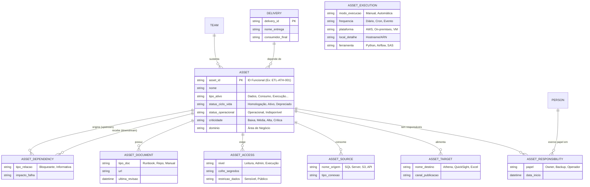

## Documento de referência — Governança de Ativos Operacionais

### Objetivo

A aplicação tem como objetivo atuar como um **hub de governança operacional**, responsável por **inventariar, padronizar, rastrear e controlar o ciclo de vida** dos ativos que suportam entregas da operação.

Nesse contexto, “ativo” não deve ser entendido apenas como um sistema ou um arquivo isolado, mas como qualquer elemento que participe da geração, transformação, publicação, disponibilização ou sustentação de uma entrega operacional. Isso inclui, por exemplo, pipelines de dados, ETLs, automações, dashboards, APIs, relatórios, exports, scripts, workflows e outros artefatos correlatos.

O propósito central da solução é permitir que a organização responda, de forma rápida e estruturada, perguntas como:

- **Identidade/Valor do ativo (o que é / O que deve ser feito)**
	- Que problema esse ativo resolve e onde ele se encaixa no negócio?*
	  
- **Ownership e stakeholders (quem responde)**
	- Quem corrige quando quebra?
	- Quem decide mudança de regra?
	- Quem sofre impacto se parar?
	
- **Operação (como roda / Como é feito)**
	- Esse ativo está performando dentro do esperado?
	- Qual o custo operacional (tempo + infra)?
	- Existe gargalo?
	
- **Ciclo de vida (tempo)**
	- Esse ativo ainda deveria existir?
	- Está sendo usado ou virou legado morto?
	- Está na fila de modernização?
	  
- **Dependência e linhagem (como se conecta)**
	- Quais as fontes de dados?
	- Onde o resultado está sendo Disponibilizado?
	- Se eu mudar isso, quem quebra?
	- Se isso parar, o que para junto?
	- Existe redundância ou ponto único de falha?
	
- **Tecnologia e arquitetura (como é construído)**
	- Consigo reproduzir esse ativo?
	- Está aderente à arquitetura alvo?
	- Está dentro do padrão ou é exceção?
	
- **Governança e risco (controle)**
	- Se esse ativo falhar, qual o prejuízo?
	- Existe risco regulatório, Reputacional, Financeiro, Segurança ou Operacional?
	- Quem pode acessar?
	- Qual o nível de privilégio (Leitura, Modificação e etc)?
	- Qual o risco de um acesso indevido?
	
- **Documentação (capacidade de sustentação)**
	- Alguém novo conseguiria operar isso (Acessos, Setup e etc.)?
	- Alguém novo conseguiria entender os impactos e importância disso?
	- As regras estão explícitas ou escondidas no código?
 
- **Entregáveis e Evoluções (MoSCoW):**
	Must (Deve ter): Sobrevivência / MVP. Sem isso, o produto morre no lançamento.
	Should (Deveria ter): Eficiência. O produto vive sem, mas é difícil ou manual. É a primeira coisa a ser feita logo após o essencial.
	Could (Poderia ter): Encanto. São as melhorias que agregam valor, mas se o prazo apertar, ninguém chora.
	Won't (Não terá): Foco. Está fora do escopo atual para evitar desperdício de energia.
	
	**Exemplo: Uma Cafeteria**
	Imagine que você vai abrir uma cafeteria amanhã:
	Deve ter: Café e água. (Sem isso, não existe o negócio).
	Deveria ter: Xícaras de cerâmica. (Você pode servir em copo plástico se precisar, mas é importante ter a xícara para a experiência ser boa).
	Poderia ter: Wi-fi gratuito. (Agrega valor e atrai gente, mas você consegue vender café sem internet).
	Não terá: Almoço completo. (Não é o foco agora, apenas café e lanches).

---

## Escopo conceitual

### Ativo

Um **ativo** é qualquer artefato operacional ou tecnológico que produza, transforme, transporte, publique, disponibilize ou suporte uma entrega da operação.

Essa definição permite governar, dentro de um mesmo modelo, tanto componentes técnicos quanto artefatos de consumo. Um pipeline, uma automação em Python, uma tabela analítica, um dashboard em QuickSight ou uma exportação recorrente para Excel podem ser tratados como ativos governáveis.

### Entrega

Uma **entrega** é o resultado efetivamente consumido pelo negócio, por áreas operacionais ou por sistemas internos/externos. Uma entrega pode depender de um ou mais ativos.

Exemplo: um dashboard executivo pode ser a entrega final, enquanto os pipelines, ETLs, views e automações que o alimentam são ativos que sustentam essa entrega.

### Sustentação

**Sustentação** corresponde ao conjunto de atividades relacionadas à continuidade operacional do ativo, incluindo operação, monitoramento, manutenção corretiva, manutenção evolutiva, suporte, atualização técnica e recuperação em caso de falha.

---

## Estrutura lógica da governança

A governança proposta parte de uma entidade central, o **ativo**, e organiza suas informações em blocos estáveis. Isso evita que dados de naturezas diferentes fiquem misturados em campos genéricos, melhora a consistência do cadastro e prepara a solução para evolução futura em banco, API e interface.

Os blocos principais são:

|Bloco|Finalidade|
|---|---|
|Identidade|Define o que o ativo é, seu contexto funcional e sua classificação|
|Responsabilidade|Indica quem responde por seu ciclo de vida e por sua operação|
|Ciclo de vida e operação|Separa fase de maturidade do ativo de seu estado operacional atual|
|Execução e infraestrutura|Registra como, quando, onde e com quais ferramentas o ativo roda|
|Dados e consumo|Mapeia entradas, saídas, canais de publicação e consumidores|
|Dependências e impacto|Permite avaliar relações entre ativos e impactos de falha ou mudança|
|Acessos e segurança|Organiza permissões necessárias para operar, administrar e consumir|
|Documentação|Centraliza repositório, runbook, manuais e evidências operacionais|
|Observabilidade|Registra monitoramento, alertas, histórico e indicadores de execução|

---

## Taxonomia inicial de ativos

Para evitar ambiguidades, recomenda-se classificar os ativos em uma taxonomia mínima, com possibilidade de expansão futura.

|Grupo|Tipos sugeridos|
|---|---|
|Dados|pipeline, ETL, dataset, tabela, view, data product|
|Consumo|dashboard, relatório, API, exportação, planilha operacional|
|Execução|automação, job, script, workflow, scheduler|
|Controle e suporte|runbook, procedimento operacional, documentação técnica|
|Integração|conector, webhook, interface sistêmica, carga externa|

Sempre que necessário, a classificação pode ser feita em dois níveis:

|Campo|Exemplo|
|---|---|
|tipo_ativo|pipeline|
|subtipo_ativo|ETL batch|

Essa separação melhora filtros, relatórios e padronização sem comprometer a simplicidade do cadastro inicial.

---

## Perguntas de negócio que o modelo deve responder

A modelagem deve ser orientada por perguntas práticas da operação. O sistema deve ser capaz de responder, de forma estruturada, às seguintes questões:

|Pergunta|Bloco principal|
|---|---|
|Para que o ativo serve?|Identidade|
|Quem sustenta e opera?|Responsabilidade|
|O ativo está em uso, em homologação ou desativado?|Ciclo de vida|
|O ativo está saudável, indisponível ou degradado?|Operação|
|Como ele executa?|Execução|
|Onde ele roda?|Infraestrutura|
|Quando executa?|Execução|
|Quais dados consome e quais saídas produz?|Dados e consumo|
|Quem consome e quem é impactado?|Dados e consumo / Impacto|
|Do que ele depende e quem depende dele?|Dependências|
|Onde está documentado?|Documentação|
|Quais acessos são necessários?|Acessos e segurança|
|Como monitorar, recuperar e sustentar?|Observabilidade / Documentação|

---

## Princípios de modelagem

A modelagem deve seguir alguns princípios simples para manter alta coesão e baixo acoplamento.
Primeiro, o ativo deve ser tratado como **entidade central**, mas não como recipiente de qualquer informação em formato livre. Responsáveis, dependências, acessos, origens, destinos e links devem, sempre que possível, ser organizados em estruturas próprias ou listas padronizadas.
Segundo, é importante separar **estado operacional** de **ciclo de vida**. Um ativo pode estar oficialmente ativo do ponto de vista de governança e, ao mesmo tempo, estar indisponível do ponto de vista operacional. Sem essa separação, o cadastro perde precisão.
Terceiro, campos amplos como “onde executa”, “como executa” e “gestão de acessos” devem ser decompostos em partes menores. Isso facilita o uso do dado em filtros, painéis, automações e integrações futuras.

---

## Modelo de informações do ativo

### 1. Identidade do ativo

Esse bloco reúne as informações que definem o ativo em termos funcionais e organizacionais.

|Campo|Descrição|
|---|---|
|asset_id|Identificador único do ativo|
|nome|Nome principal do ativo|
|nome_curto|Nome resumido para exibição|
|tipo_ativo|Categoria principal do ativo|
|subtipo_ativo|Subclassificação opcional|
|dominio|Domínio de negócio ou área macro|
|esteira|Contexto operacional específico|
|descricao_funcional|Descrição objetiva do que o ativo faz|
|objetivo_negocio|Finalidade do ativo para a operação ou negócio|

O campo `asset_id` deve ser padronizado e legível, sempre que possível. Em vez de depender apenas de UUID técnico, é recomendável adotar um identificador funcional, como `ETL-ATH-00023`, desde que a regra seja consistente.

---

### 2. Responsabilidade e governança

Esse bloco define os responsáveis pelo ciclo de vida, operação e continuidade do ativo.

|Campo|Descrição|
|---|---|
|owner_id|Responsável principal pelo ciclo de vida|
|backup_owner_id|Responsável substituto|
|operador_id|Responsável pela operação ou acompanhamento recorrente|
|gestor_responsavel_id|Gestor da estrutura responsável|
|time_id|Time, célula ou squad responsável|
|stakeholders|Consumidores-chave ou interessados relevantes|
|areas_impactadas|Áreas que sofrem impacto direto do ativo|

O **owner** não deve ser confundido com o operador. O owner responde pela governança e continuidade do ativo; o operador pode ser quem executa, monitora ou acompanha seu funcionamento no dia a dia.

---

### 3. Ciclo de vida e estado operacional

Esse bloco separa maturidade do ativo de sua condição operacional no momento atual.

|Campo|Descrição|
|---|---|
|status_ciclo_vida|Fase do ativo: rascunho, homologação, ativo, depreciado, desativado|
|status_operacional|Estado atual: operacional, indisponível, degradado, pausado|
|criticidade|Grau de importância: baixa, média, alta, crítica|
|processo_critico|Indica se suporta processo crítico|
|impacto_falha|Consequência esperada em caso de indisponibilidade|
|plano_contingencia|Ação prevista para recuperação ou mitigação|

Essa separação é essencial. Um ativo pode estar com `status_ciclo_vida = ativo` e `status_operacional = indisponível`. Isso permite representar o cenário real sem distorcer o cadastro.

---

### 4. Datas e versionamento

Esse bloco registra a evolução do ativo ao longo do tempo.

|Campo|Descrição|
|---|---|
|data_criacao|Data de criação do ativo|
|data_ativacao|Data de entrada em operação|
|ultima_modificacao|Última alteração relevante|
|ultima_execucao|Última execução conhecida|
|ultima_revisao_documentacao|Data da última revisão documental|
|versao_atual|Versão atual do ativo|

Sempre que possível, `versao_atual` deve seguir uma convenção consistente, como **SemVer** (`1.4.2`) ou outra estratégia padronizada pela equipe.

---

### 5. Execução e infraestrutura

Esse bloco descreve a forma de execução do ativo e sua localização operacional.

|Campo|Descrição|
|---|---|
|modo_execucao|manual, automatica, semi_automatica|
|gatilho_execucao|cron, evento, API, humano, agendamento externo|
|frequencia_execucao|sob_demanda, intradiario, diario, semanal, mensal|
|cron_expression|Expressão CRON, quando aplicável|
|janela_execucao|Janela esperada de processamento|
|ferramenta_execucao|Python, Alteryx, SAS, Step Functions, Airflow etc.|
|ambiente_execucao|local, on_premises, cloud, hibrido|
|plataforma_execucao|AWS, VM Windows, servidor Linux, desktop local etc.|
|local_execucao_detalhe|Hostname, cluster, conta cloud, serviço ou outro detalhe técnico|
|tempo_medio_execucao|Duração média da execução|
|timeout_execucao|Limite de execução esperado|

É importante não misturar `ambiente_execucao`, `plataforma_execucao` e `local_execucao_detalhe`. Embora pareçam semelhantes, cada um responde a uma pergunta distinta:

- **ambiente_execucao**: em que tipo de ambiente ele roda;
- **plataforma_execucao**: em qual tecnologia ou plataforma ele está hospedado;
- **local_execucao_detalhe**: onde exatamente ele roda.

---

### 6. Dados, integrações e consumo

Esse bloco registra entradas, saídas e formas de consumo do ativo.

|Campo|Descrição|
|---|---|
|origens_dados|Fontes utilizadas pelo ativo|
|destinos_dados|Saídas técnicas produzidas|
|canais_publicacao|Onde o resultado é publicado ou exposto|
|consumidores_sistema|Sistemas consumidores|
|consumidores_negocio|Áreas, equipes ou usuários consumidores|
|latencia_esperada|Prazo esperado entre origem e disponibilização|
|tipo_saida|Dashboard, tabela, arquivo, API, export etc.|

Esse bloco é importante para mapear tanto **lineage simplificado** quanto **distribuição do consumo**. Um ativo pode ler dados do SQL Server, gravar em S3, disponibilizar em Athena e ter consumo final em QuickSight e Excel.

---

### 7. Dependências e impacto

Esse bloco responde à pergunta mais importante de governança: “se isso mudar ou falhar, quem será impactado?”.

|Campo|Descrição|
|---|---|
|dependencias_upstream|Ativos ou fontes das quais o ativo depende|
|dependencias_downstream|Ativos, sistemas ou entregas que dependem dele|
|ativos_relacionados|Relações técnicas ou funcionais relevantes|
|entregas_relacionadas|Entregas suportadas por esse ativo|

Esse conjunto de informações permite identificar riscos de mudança, organizar análise de impacto e apoiar a priorização de sustentação.

---

### 8. Acessos e segurança

Esse bloco organiza os requisitos de acesso necessários à operação, administração e consumo.

|Campo|Descrição|
|---|---|
|acessos_execucao|Permissões necessárias para executar ou operar|
|acessos_consumo|Permissões necessárias para consumir o resultado|
|acessos_administracao|Permissões para manutenção, alteração ou gestão|
|grupo_responsavel|Grupo ou perfil associado ao ativo|
|perfil_cloud|Perfil técnico em ambiente cloud, quando houver|
|cofre_segredos|Local onde segredos ou credenciais são armazenados|
|restricao_dados|Classificação de sensibilidade ou restrição|

O objetivo aqui não é apenas registrar “quem tem acesso”, mas estruturar **o que é necessário**, **onde é solicitado** e **qual o nível de permissão exigido**.

---

### 9. Documentação e artefatos operacionais

Esse bloco centraliza as referências necessárias para entendimento, operação e recuperação do ativo.

|Campo|Descrição|
|---|---|
|repo_url|Repositório de código ou versionamento|
|doc_url|Documentação funcional ou técnica|
|runbook_url|Procedimento operacional e recuperação|
|manual_operacional_url|Instruções de uso e sustentação|
|painel_monitoramento_url|Painel de acompanhamento técnico|
|tickets_relacionados|Demandas, incidentes ou evoluções associadas|
|links_operacionais|Links úteis como ARN, view, dashboard, endpoint etc.|

A existência de documentação deve ser tratada como requisito de governança. Um ativo sem documentação mínima pode existir tecnicamente, mas sua sustentação é frágil e arriscada.

---

### 10. Observabilidade e qualidade operacional

Esse bloco mede se o ativo é realmente operável em contexto produtivo.

|Campo|Descrição|
|---|---|
|monitorado|Indica se existe monitoramento ativo|
|alerta_configurado|Indica se existe alerta configurado|
|canal_alerta|Canal de notificação em caso de falha|
|ultimo_status_execucao|Último resultado conhecido da execução|
|taxa_falha|Indicador de falha recorrente|
|sla_suporte|Prazo esperado para atendimento|
|sla_recuperacao|Prazo esperado para restabelecimento|

Esse bloco é especialmente útil para diferenciar ativos apenas cadastrados de ativos com governança operacional madura.

---

## Campos estruturados versus texto livre

Embora o cadastro inicial possa começar com campos de preenchimento simples, nem toda informação deve permanecer como texto livre. Alguns itens perdem muito valor analítico quando não são estruturados.

|Informação|Abordagem recomendada|
|---|---|
|Responsáveis|Referência a pessoa ou tabela de pessoas|
|Times|Referência a equipe/célula|
|Origens e destinos|Lista estruturada ou tabela relacional|
|Dependências|Relação entre ativos|
|Links|Tabela de documentos/artefatos|
|Acessos|Estrutura por tipo de acesso|

Na prática, isso significa que o ativo deve ser a entidade principal, mas não a única.

---

## Estrutura lógica mínima para evolução do sistema

Para permitir escalabilidade sem excesso de complexidade, recomenda-se a seguinte estrutura mínima de entidades:

|Entidade|Papel|
|---|---|
|asset|Registro principal do ativo|
|asset_type|Classificação do ativo|
|person|Pessoas relacionadas|
|team|Estruturas organizacionais|
|asset_responsibility|Papéis de owner, backup e operador|
|asset_dependency|Relações entre ativos|
|asset_source|Origens de dados|
|asset_target|Destinos de dados|
|asset_document|Links e documentação|
|asset_access|Acessos e requisitos|
|asset_execution|Informações operacionais de execução|
|asset_consumer|Consumidores e áreas impactadas|
|asset_history|Histórico de mudanças e governança|

Essa estrutura já é suficiente para um MVP robusto e, ao mesmo tempo, preserva espaço para expansão futura.

---

## Casos de uso que a modelagem resolve diretamente

A modelagem proposta permite responder, com clareza, a perguntas recorrentes da operação:

| Pergunta operacional               | Campos principais                                                |
| ---------------------------------- | ---------------------------------------------------------------- |
| O que é meu?                       | owner, time, dominio, tipo_ativo                                 |
| Onde isso executa?                 | ambiente_execucao, plataforma_execucao, local_execucao_detalhe   |
| Quem assume se o responsável sair? | backup_owner, runbook_url                                        |
| O que esse ativo impacta?          | dependencias_downstream, entregas_relacionadas, areas_impactadas |
| Qual o risco se falhar?            | criticidade, impacto_falha, plano_contingencia                   |
| Onde está a documentação?          | doc_url, repo_url, runbook_url                                   |
| Quem consome?                      | consumidores_negocio, consumidores_sistema, stakeholders         |
| Quais acessos são necessários?     | acessos_execucao, acessos_consumo, acessos_administracao         |
| O ativo é monitorado?              | monitorado, alerta_configurado, canal_alerta                     |

---

## Conclusão

A proposta de modelagem deve ser entendida como uma estrutura de governança centrada no ativo, mas organizada em blocos especializados. O ganho principal não está apenas em cadastrar ativos, e sim em **tornar visível sua operação, sua responsabilidade, suas dependências, sua documentação e seu risco**.

Em termos práticos, a recomendação é:
- manter o **ativo** como entidade central;
- separar claramente **identidade, execução, governança, dependências e documentação**;
- evitar campos excessivamente genéricos;
- estruturar como entidades próprias os elementos com maior valor analítico, como pessoas, dependências, acessos e documentos;
- iniciar com um **MVP enxuto**, mas já compatível com expansão futura.

O resultado esperado é um hub capaz de apoiar inventário, sustentação, análise de impacto, continuidade operacional e padronização da governança de ativos que suportam as entregas da organização.
Se quiser, no próximo passo eu posso converter esse conteúdo para um formato mais próximo de **especificação funcional**, **dicionário de dados** ou **modelo entidade-relacionamento lógico**.