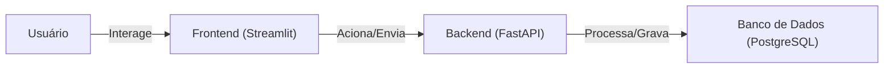
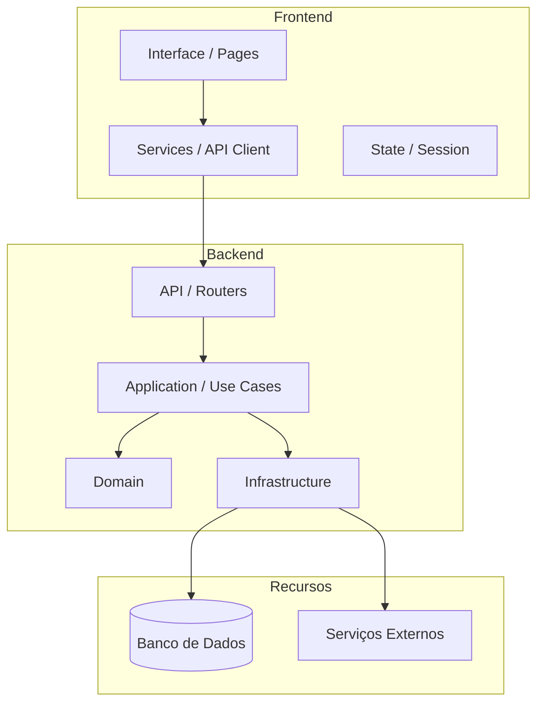
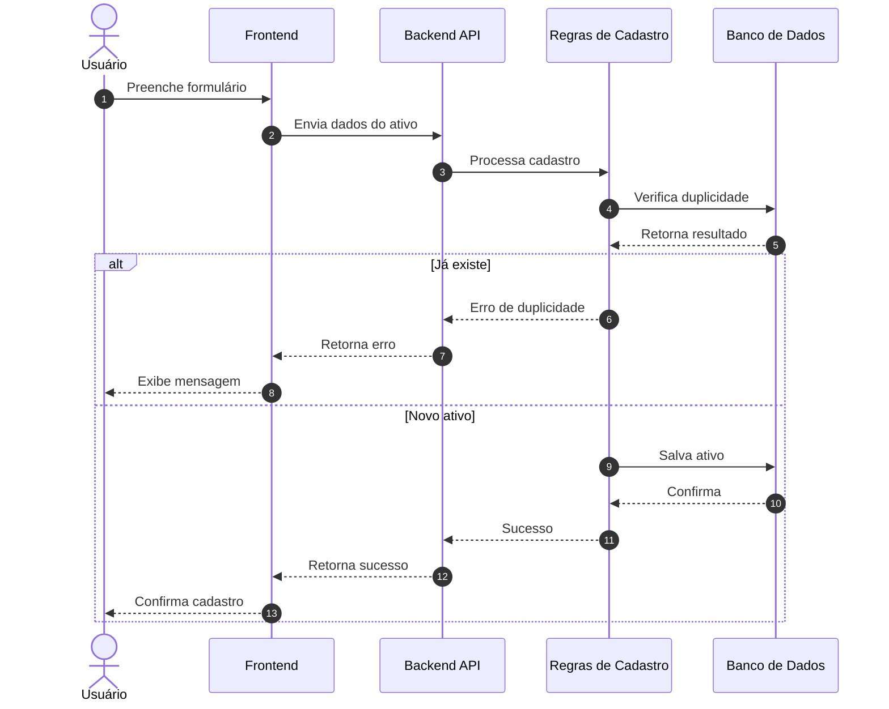

## Visão Geral

Este projeto é estruturado como um **monorepo com múltiplas aplicações**, composto por:

* um **backend** responsável pelas regras de negócio e persistência;
* um **frontend** responsável pela interface e interação com o usuário;
* uma camada de **infraestrutura** que sustenta execução, banco e deploy;
* uma camada de **documentação** que descreve e governa o sistema.

A arquitetura segue uma separação clara de responsabilidades, com o objetivo de:

* manter o código organizado e evolutivo;
* reduzir acoplamento entre componentes;
* facilitar testes, manutenção e deploy;
* tornar o sistema compreensível para diferentes perfis (técnico e negócio).

---

## Estrutura do Repositório

```plaintext
project-root/
├── apps/
│   ├── backend/
│   │   ├── src/backend/
│   │   ├── tests/
│   │   ├── scripts/
│   │   ├── alembic/
│   │   ├── Dockerfile
│   │   ├── .dockerignore
│   │   ├── README.md
│   │   └── pyproject.toml
│   │
│   └── frontend/
│       ├── src/frontend/
│       ├── tests/
│       ├── Dockerfile
│       ├── .dockerignore
│       ├── README.md
│       └── pyproject.toml
│
├── docs/
├── infra/
├── scripts/
├── .github/workflows/
├── README.md
└── mkdocs.yml
```

---

## Arquitetura Conceitual



### Interpretação

- o **usuário** interage com o frontend;
- o **frontend** envia as ações para o backend;
- o **backend** processa e consulta/grava no banco.

---

## Arquitetura em Camadas



---

## Backend — Estrutura e Responsabilidades

```plaintext
src/backend/
├── api/              # Entrada HTTP (FastAPI)
├── application/      # Casos de uso
├── domain/           # Regras de negócio
├── infrastructure/   # Banco, integrações e segurança
├── schemas/          # Contratos de entrada/saída
└── core/             # Configuração, logging, constantes
```

### Papéis das camadas

* **api/**: recebe requisições e retorna respostas.
* **application/**: coordena o fluxo do sistema.
* **domain/**: define as regras e conceitos do negócio.
* **infrastructure/**: implementa detalhes técnicos.
* **schemas/**: estrutura dos dados da API.
* **core/**: elementos transversais.

---

## Frontend — Estrutura e Responsabilidades

```plaintext
src/frontend/
├── app.py
├── pages/        # Telas do sistema
├── components/   # Elementos reutilizáveis
├── services/     # Comunicação com backend
├── schemas/      # Estrutura de dados
├── state/        # Controle de estado
├── utils/        # Funções auxiliares
├── config/       # Configurações
└── assets/       # Arquivos estáticos
```

### Papéis das camadas

* **pages/**: representam as telas do sistema.
* **components/**: blocos reutilizáveis.
* **services/**: chamadas para API.
* **state/**: controle de sessão e estado.
* **schemas/**: representação dos dados.
* **utils/**: funções auxiliares.
* **config/**: parâmetros da aplicação.

## Infraestrutura — Estrutura e Responsabilidades

```plaintext
infra/
├── docker/
│   ├── compose.yml          # Definição base dos serviços
│   ├── compose.dev.yml      # Configurações para desenvolvimento
│   ├── compose.prod.yml     # Configurações para produção
│   └── nginx/
│       └── nginx.conf       # Reverse proxy (roteamento e entrada única)
│
├── postgres/
│   └── init.sql             # Script de inicialização do banco
│
└── env/
    ├── backend.env.example  # Variáveis de ambiente do backend
    └── frontend.env.example # Variáveis de ambiente do frontend
```

### Papéis das camadas

* **docker/**: responsável por orquestrar os serviços da aplicação.
* **compose.yml**: define a base comum (backend, frontend, banco, etc.).
* **compose.dev.yml**: adapta o ambiente para desenvolvimento (hot reload, logs mais verbosos).
* **compose.prod.yml**: adapta para produção (otimização, segurança, escala).
* **nginx/**: atua como ponto de entrada único, roteando requisições para frontend e backend.
* **postgres/**: define a inicialização do banco de dados.
* **init.sql**: cria estruturas iniciais (tabelas, extensões, usuários, permissões).
* **env/**: centraliza exemplos de configuração por ambiente.
* **backend.env.example**: variáveis necessárias para execução do backend.
* **frontend.env.example**: variáveis necessárias para execução do frontend.


---

## Caso de Uso: Cadastro de um Ativo




