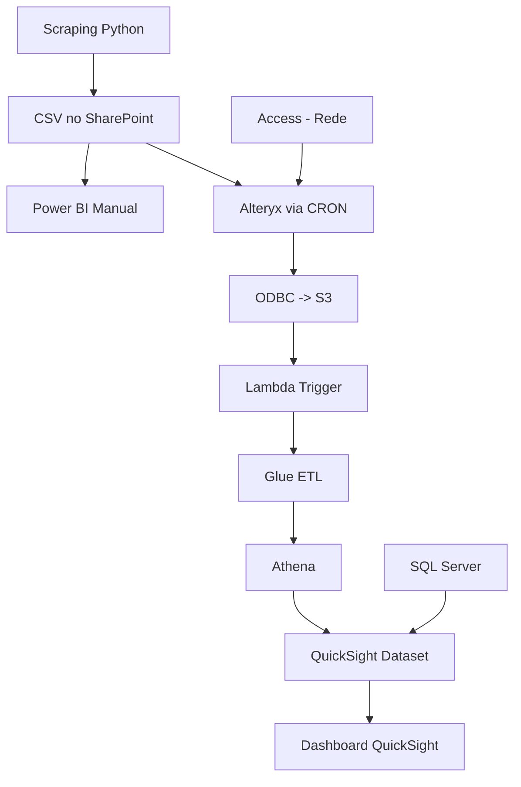
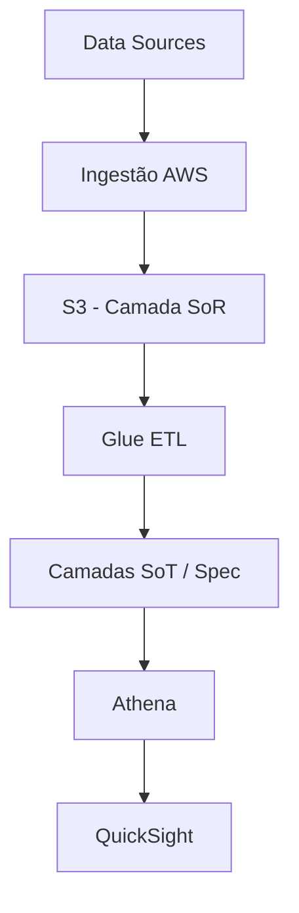
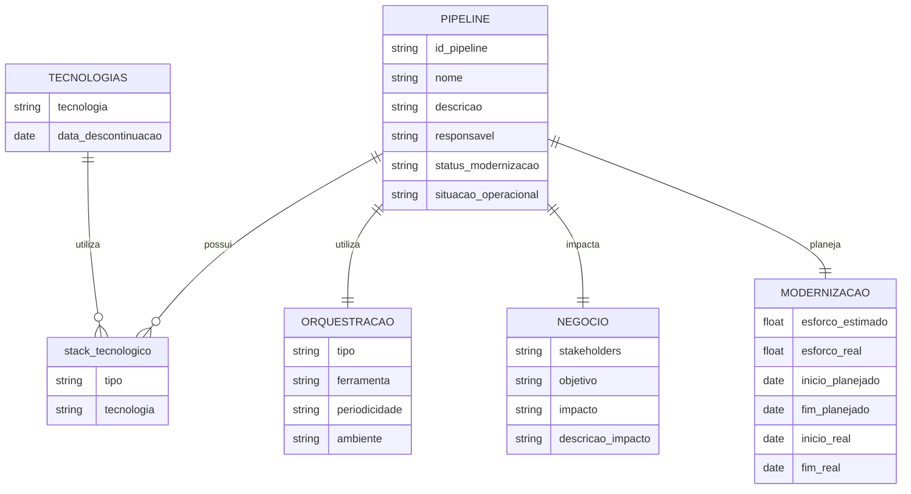

# Contexto e Objetivo da Modernização

A modernização do ecossistema de dados tem como objetivo substituir uma arquitetura heterogênea, fortemente dependente de ferramentas locais, scripts manuais e integrações frágeis, por uma arquitetura padronizada, escalável e governada na AWS. O direcionador principal não é apenas tecnológico, mas estrutural: centralizar a responsabilidade de ingestão e disponibilização de dados na camada de tecnologia, enquanto a camada analítica passa a consumir dados já tratados e confiáveis.

Nesse cenário, a AWS atua como plataforma unificadora, utilizando serviços como S3 (armazenamento), Glue (ETL e catálogo), Athena (consulta), Step Functions/EventBridge (orquestração) e QuickSight (consumo). No entanto, a solução deve ser agnóstica de ferramenta na camada de governança, permitindo evoluções tecnológicas sem comprometer o modelo de controle.

A modernização exige compreender o estado atual (“AS-IS”) com granularidade suficiente para permitir decisões estruturadas de priorização, risco e esforço, e definir um estado futuro (“TO-BE”) com base em padrões arquiteturais claros.

---

# Modelo Conceitual de Pipeline de Dados

Independentemente da tecnologia, qualquer pipeline pode ser abstraída em quatro etapas fundamentais:

* Extração: conexão com fontes de dados (bancos, APIs, arquivos, sistemas externos)
* Transformação: aplicação de regras de negócio, limpeza, enriquecimento e padronização
* Carga: persistência dos dados tratados em um repositório estruturado
* Consumo: disponibilização para usuários finais ou sistemas downstream

Essa abstração é importante porque permite dissociar o problema da ferramenta utilizada e focar na função exercida dentro da arquitetura.

---

# Análise da Pipeline Atual (AS-IS)

O exemplo apresentado evidencia um cenário típico de fragmentação tecnológica e acoplamento operacional:



Esse fluxo apresenta alguns problemas estruturais relevantes:

A ingestão depende de scraping, que é inerentemente frágil, sujeito a mudanças de interface e sem garantias de integridade. O armazenamento intermediário em CSV no SharePoint cria dependência de arquivos não governados, sem versionamento adequado. A orquestração é distribuída (manual, cron, eventos), dificultando rastreabilidade. Há múltiplas ferramentas de ETL (Python, Alteryx, Glue), o que fragmenta a lógica de transformação. A ativação do ETL via Lambda acoplada ao S3 indica ausência de uma orquestração centralizada. O consumo ainda depende de junções em tempo de visualização (QuickSight com SQL Server), aumentando latência e complexidade.

Em termos de arquitetura, isso representa baixa coesão e alto acoplamento, além de um fluxo difícil de observar e governar.

---

# Arquitetura Alvo (TO-BE)

A arquitetura alvo busca centralizar responsabilidades, reduzir redundâncias e padronizar o fluxo dentro da AWS.



A principal mudança conceitual é a separação clara de responsabilidades:

A ingestão passa a ser responsabilidade da tecnologia, eliminando scraping e dependência de arquivos intermediários. O S3 se torna o ponto central de armazenamento, estruturado em camadas (SoR, SoT, Spec), permitindo governança e versionamento. O Glue assume o papel de engine de transformação, consolidando regras de negócio. O Athena fornece acesso padronizado aos dados, desacoplando armazenamento e consumo. A orquestração é centralizada via Step Functions/EventBridge, eliminando execuções manuais e distribuídas.

Essa abordagem reduz significativamente a complexidade operacional e aumenta a rastreabilidade.

---

# Princípios de Modernização

A modernização não deve ser vista como uma simples substituição de ferramentas, mas como uma reestruturação baseada em princípios:

Centralização da ingestão e armazenamento, evitando múltiplos pontos de entrada. Padronização de pipelines, reduzindo diversidade tecnológica desnecessária. Separação entre ingestão, transformação e consumo, evitando acoplamento entre camadas. Orquestração explícita e observável, substituindo triggers implícitos. Governança orientada a metadados, permitindo análise e priorização.

---

# Modelo de Governança da Modernização

A governança da modernização deve ser tratada como um modelo de dados operacional, não apenas como um cadastro descritivo. O objetivo é permitir análises estruturadas, priorização baseada em critérios objetivos e rastreabilidade completa do ciclo de vida das pipelines.

Para isso, o modelo precisa atender três requisitos simultâneos: granularidade suficiente para análise, padronização para consistência e flexibilidade para acomodar diferentes tipos de pipelines.

A seguir, a seção é expandida com exemplos concretos em formato tabular, JSON e um modelo conceitual.


---
## Modelo Conceitual de Dados (Entidades e Relacionamentos)

Para evitar um modelo excessivamente “flat” e permitir escalabilidade, é recomendável estruturar a governança em entidades relacionadas.



Esse modelo permite evoluir a governança sem criar colunas excessivas e facilita análises mais complexas, como:

* pipelines com múltiplas tecnologias legadas
* correlação entre impacto e esforço
* análise de gargalos por tipo de orquestração
* priorização baseada em risco tecnológico

---

## Estrutura Consolidada de Dados

A tabela abaixo representa o schema lógico

| Campo                | Descrição de Campo                                     | Exemplo de Dados                                                     | Tipo do Dado            | Picklist Values                                                                                 | Descrição do Picklist                                                                                                                                                                                                                                                                                                                                                                              | Observações                                                                                                                                                                                                                                                 |
| -------------------- | ------------------------------------------------------ | -------------------------------------------------------------------- | ----------------------- | ----------------------------------------------------------------------------------------------- | -------------------------------------------------------------------------------------------------------------------------------------------------------------------------------------------------------------------------------------------------------------------------------------------------------------------------------------------------------------------------------------------------- | ----------------------------------------------------------------------------------------------------------------------------------------------------------------------------------------------------------------------------------------------------------- |
| id_pipeline          | Identificador único gerado automaticamente no cadastro | e6a3d4fb-0d55-4558-b6f2-f97ec44843d0                                 | String(uuid4)           | —                                                                                               |                                                                                                                                                                                                                                                                                                                                                                                                    |                                                                                                                                                                                                                                                             |
| nome_pipeline        | Nome funcional                                         | Raspagem Operacional Cartões                                         | String                  | —                                                                                               |                                                                                                                                                                                                                                                                                                                                                                                                    |                                                                                                                                                                                                                                                             |
| descricao            | Descrição detalhada                                    | Coleta via scraping + Access + dashboard                             | String                  | —                                                                                               |                                                                                                                                                                                                                                                                                                                                                                                                    |                                                                                                                                                                                                                                                             |
| responsavel          | Dono da pipeline                                       | Squad de Modernização                                                | String                  | —                                                                                               |                                                                                                                                                                                                                                                                                                                                                                                                    |                                                                                                                                                                                                                                                             |
| status_modernizacao  | Estado atual                                           | Em Refinamento                                                       | Picklist                | Inapta; Backlog; Em Desenvolvimento; Em Homologação; Em Refinamento; Concluída;                 | **Inapta:** Existem impeditivos que impossibilitam a modernização<br><br>**Backlog:** Está na lista de tarefas futuras<br><br>**Em Desenvolvimento:** Já priorizada e está em desenvolvimento<br><br>**Em Homologação:** Em fase de testes e aprovação pelos Steakholders<br><br>**Em Refinamento:** Já está modernizado mas precisa de ajustes<br><br>**Concluída:** A modernização está completa | **Modernizada** (Concluído)<br><br>**Em Transição** (Em Desenvolvimento; Em Refinamento; Em Homologação)<br><br>**Legado** (Backlog; Inapta)<br>                                                                                                            |
| situacao_operacional | Estada atual de uso da pipeline                        | Em operação                                                          | Picklist                | Em operação); Pausada; Descontinuada<br>                                                        | **Em operação:** Está operando normalmente<br><br>**Pausada:** Foi pausada por alguma complicação técnica, mas não significa que não é mais necessária<br><br>**Descontinuada:** Foi descontinuada de forma definitiva. Os motivos podem ser ser diversos, como por exemplo, estar obsoleta, foi substituída por outra pipeline, Não é mais necessária                                             | **Ativa** (Em operação)<br><br>**Inativa** (Pausada; Descontinuada)                                                                                                                                                                                         |
| stack_tecnologico    | Tecnologias utilizadas                                 | Python, CSV, SharePoint, Alteryx, Access                             | Picklist / Multi-select | SQL Server; API Salesforce; GDX; PostgreSQL; SAS; SQLite; Access; Sharepoint; Rede Corporativa; | Ele vai conter listadas as principais tecnologias usadas, além disso, é um campo expansível, ou seja, podemos inserir novas tecnologias não listadas, respeitando a categorização.                                                                                                                                                                                                                 | Não vamos manter o histórico do Stack. Conforme as pipelines vão sendo modernizadas, o Stack tecnológico vai sendo atualizado.<br><br>As categorias das Tecnologias podem ser resumidas em<br>Data Source; Repositórios; ETL; Orquestração; DataViz<br><br> |
| ambiente_execucao    | Onde roda                                              | Híbrido                                                              | Picklist                | Local; On-Premises; Cloud; Híbrido                                                              |                                                                                                                                                                                                                                                                                                                                                                                                    |                                                                                                                                                                                                                                                             |
| orquestracao_tipo    | Forma de execução                                      | Misto                                                                | Picklist                | Manual; Agendado; Event-Driven; Misto                                                           |                                                                                                                                                                                                                                                                                                                                                                                                    |                                                                                                                                                                                                                                                             |
| orquestrador         | Ferramenta usada                                       | CRON                                                                 | Multi-select / Tags     | CRON; Task Scheduler; Event Bridge; Airflow; Step Functions; Lambda; Outro                      |                                                                                                                                                                                                                                                                                                                                                                                                    |                                                                                                                                                                                                                                                             |
| periodicidade        | Frequência                                             | Diário                                                               | Picklist                | Ad-hoc; Horário; Diário; Semanal; Mensal                                                        |                                                                                                                                                                                                                                                                                                                                                                                                    |                                                                                                                                                                                                                                                             |
| impacto_negocio      | Criticidade                                            | Alto                                                                 | Picklist                | Baixo; Médio; Alto; Crítico                                                                     |                                                                                                                                                                                                                                                                                                                                                                                                    |                                                                                                                                                                                                                                                             |
| stakeholders         | Áreas impactadas                                       | Operações; Planejamento; Diretoria de Pagamento; Comunidade Jurídica | Multi-select / Tags     | Valores livres (ou lista de áreas da empresa)                                                   |                                                                                                                                                                                                                                                                                                                                                                                                    |                                                                                                                                                                                                                                                             |
| objetivo_pipeline    | Tipo de entrega                                        | Dashboard                                                            | Picklist                | Alerta; Dashboard; Base Analítica; ML; Integração; Relatório                                    |                                                                                                                                                                                                                                                                                                                                                                                                    |                                                                                                                                                                                                                                                             |
| esforco_estimado     | Horas previstas                                        | 120                                                                  | Integer                 | —                                                                                               |                                                                                                                                                                                                                                                                                                                                                                                                    |                                                                                                                                                                                                                                                             |
| esforco_real         | Horas realizadas                                       | 40                                                                   | Integer                 | —                                                                                               |                                                                                                                                                                                                                                                                                                                                                                                                    |                                                                                                                                                                                                                                                             |
| data_inicio_plan     | Planejado                                              | 2026-04-01                                                           | Date                    | —                                                                                               |                                                                                                                                                                                                                                                                                                                                                                                                    |                                                                                                                                                                                                                                                             |
| data_fim_plan        | Planejado                                              | 2026-05-15                                                           | Date                    | —                                                                                               |                                                                                                                                                                                                                                                                                                                                                                                                    |                                                                                                                                                                                                                                                             |
| data_inicio_real     | Real                                                   | 2026-04-05                                                           | Date                    | —                                                                                               |                                                                                                                                                                                                                                                                                                                                                                                                    |                                                                                                                                                                                                                                                             |
| data_fim_real        | Real                                                   | null                                                                 | Date                    | —                                                                                               |                                                                                                                                                                                                                                                                                                                                                                                                    |                                                                                                                                                                                                                                                             |

---

## Representação em JSON (Modelo Operacional)

Esse formato é útil para APIs, armazenamento em NoSQL ou manipulação em aplicações (ex: Streamlit, FastAPI).

```json
{
  "id_pipeline": "e6a3d4fb-0d55-4558-b6f2-f97ec44843d0",
  "nome_pipeline": "Raspagem Operacional Cartões",
  "descricao": "Pipeline que coleta dados via scraping, cruza com base Access e gera dashboard no QuickSight",
  "responsavel": "Squad de Modernização",
  "status_modernizacao": "Em Refinamento",
  "situacao_operacao": "Ativa",
  "criticidade_tecnica": "Crítica",
  "tipo_ingestao": "Scraping",
  "camada_dados": "SoR",
  "pipelines_dependentes": [
    "PIPE-002",
    "PIPE-003"
  ],
  "stack_tecnologico": {
    "linguagens": [
      "Python"
    ],
    "etl": [
      "Alteryx"
    ],
    "bancos": [
      "Access"
    ],
    "armazenamento": [
      "CSV",
      "SharePoint"
    ],
    "integracoes": [
      "Scraping"
    ]
  },
  "ambiente_execucao": "Híbrido",
  "orquestracao": {
    "tipo": "Misto",
    "ferramentas": [
      "CRON",
      "Lambda"
    ],
    "periodicidade": "Diário"
  },
  "negocio": {
    "stakeholders": [
      "Operações",
      "Planejamento",
      "Diretoria de Pagamentos",
      "Comunidade Jurídica"
    ],
    "objetivo": "Dashboard",
    "impacto_negocio": "Alto",
    "descricao_impacto": "Atraso na identificação de falhas operacionais e perda de visibilidade diária sobre o processo."
  },
  "modernizacao": {
    "squad_responsavel": "plataforma_dados",
    "esforco_estimado_horas": 120,
    "esforco_real_horas": 40,
    "cronograma": {
      "inicio_planejado": "2026-04-01",
      "fim_planejado": "2026-05-15",
      "inicio_real": "2026-04-05",
      "fim_real": null
    }
  }
}
```

---

## Indicadores

### Visão Geral

| Indicador                 | Descrição                                 | Visualização   | Referência DataViz                      |
| ------------------------- | ----------------------------------------- | -------------- | --------------------------------------- |
| Total de Pipelines        | Quantidade total cadastrada no inventário | Big Number     | KPI / Big Number (datavizcatalogue.com) |
| Pipelines Ativas          | Total de pipelines em operação ativa      | Big Number     | KPI / Big Number                        |
| Pipelines Críticas        | Total com impacto alto ou crítico         | Big Number     | KPI / Big Number                        |
| Pipelines em Modernização | Total com status ≠ Backlog/Descontinuada  | Big Number     | KPI / Big Number                        |
| % Modernizadas            | Percentual de pipelines concluídas        | Big Number (%) | KPI + Percentage                        |

---
### Operação Atual

|Indicador|Descrição|Visualização|Referência DataViz|
|---|---|---|---|
|Situação de Operação|Distribuição entre estados|Gráfico de barras|Bar Chart (datavizcatalogue.com)|
|Pipelines por Impacto|Quantidade por nível de impacto|Gráfico de barras|Bar Chart|
|Pipelines por Criticidade Técnica|Distribuição do risco técnico|Gráfico de barras|Bar Chart|
|Pipelines por Tipo de Ingestão|Distribuição por origem|Gráfico de barras|Bar Chart|
|Pipelines por Ambiente|Local vs Cloud vs Híbrido|Gráfico de barras|Bar Chart|
|Top Tecnologias Legadas|Tecnologias mais usadas|Barras (Top N)|Ranked Bar Chart (datavizproject.com)|

---
### Progresso da Modernização

| Indicador                   | Descrição                 | Visualização      | Referência DataViz                      |
| --------------------------- | ------------------------- | ----------------- | --------------------------------------- |
| Status de Modernização      | Distribuição por estágio  | Funil ou barras   | Funnel Chart (anychart.com) / Bar Chart |
| Pipelines no Legado         | Total não iniciadas       | Big Number        | KPI                                     |
| Pipelines em Transição      | Em migração               | Big Number        | KPI                                     |
| Pipelines Concluídas        | Total modernizadas        | Big Number        | KPI                                     |
| Evolução da Modernização    | Volume acumulado no tempo | Linha             | Line Chart (datavizcatalogue.com)       |

---
### Planejamento

| Indicador                    | Descrição                        | Visualização | Referência DataViz                |
| ---------------------------- | -------------------------------- | ------------ | --------------------------------- |
| Pipelines Planejadas         | Total com esforço definido       | Big Number   | KPI                               |
| Esforço Total Planejado      | Soma de horas                    | Big Number   | KPI                               |
| Esforço Médio por Pipeline   | Média de esforço                 | Big Number   | KPI                               |
| Volume Planejado por Período | Entregas ao longo do tempo       | Linha        | Line Chart                        |
| Capacidade vs Demanda        | Comparação esforço vs capacidade | Barras       | Grouped Bar Chart                 |
| Priorização (GUT / Risco)    | Score de priorização             | Scatter      | Scatter Plot (datavizproject.com) |

---
### Execução

|Indicador|Descrição|Visualização|Referência DataViz|
|---|---|---|---|
|Pipelines Entregues|Total no período|Big Number|KPI|
|Lead Time Médio|Tempo médio|Big Number|KPI|
|Throughput|Entregas por período|Barras ou linha|Bar Chart / Line Chart|
|Desvio de Prazo|Planejado vs real (datas)|Barras|Variance Bar Chart|
|Desvio de Esforço|Planejado vs real (horas)|Barras|Variance Chart|
|Aderência ao Planejamento|% dentro do prazo|Gauge|Gauge Chart (anychart.com)|
|Burndown de Modernização|Trabalho restante|Linha|Burndown Chart (anychart.com)|

---
### Decisão (Priorização)

|Indicador|Descrição|Visualização|Referência DataViz|
|---|---|---|---|
|Score GUT|Gravidade x Urgência x Tendência|Ranking / tabela|Ranked Table|
|Score de Risco|Impacto x criticidade técnica|Ranking / tabela|Ranked Table|
|Matriz Esforço x Impacto|Relação esforço vs impacto|Scatter|Scatter Plot|
|Backlog Priorizado|Lista ordenada por score|Tabela|Ordered Table|
